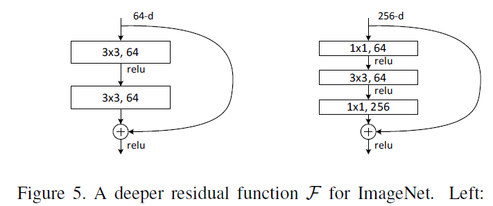

# [Paper01] Deep Residual Learning for Image Recognition

## 내맘대로 키워드
    ResNet-18, 34, 50, 101, 152
    Degradation problem
    Residual learning - a building block, 
    Identity mapping by Shortcut Connections
    Projection Shortcuts
    Bottleneck Architectures

## 논문 순서에 맞춰 내용 요약
### 0. Abstract
    > DNN는 깊어질수록 학습하기 어려워진다 => 'Residual network'로 해결책을 제시한다
    > 더 빠르고 쉽게 최적화되고 높은 Accuracy를 보여준다.
    > VGGNet 보다 8배 깊으면서도 덜 복잡하며 ImageNet test set 기준 3.57% error로 매우 줄였다.
### 1. Introduction
* Problem of vanishing/exploding gradients : normalized initialization, intermediate normalization layers로 해결할 수 있다.
* Degradation problem : 
  - 층이 쌓일수록 training error가 감소하다가 일정 숫자 이상부터 증가하는 현상
  - 단순 identity mapping을 의도한 layer(비선형)를 추가했을 때 의도한 해답을 찾을 수 없었음 
  

  - F(x) = H(x) - x 인 Residual Block을 추가하여 극단적인 경우 F(x) = 0 이 되어 H(x) = x 을 흉내내려고 시도한다. 
  

### 2. Related Work
* Residual Representations
  - 이미지 인식에서의 VLAD
  - Fisher Vector
  - Vector quantization
* Shortcut Connections
  - 오랜 기간 연구되어 왔다.
  - input과 output을 바로 연결하는 시도
  - vanishing/exploding gradients를 해결하려고 중간 레이어에 연결
  - layer response, gradient, propagated error를 centering하는 방법
  - inception layer에서도 사용됨
  - Highway networks : data-dependent, have parameters, gate closed(approaching 0) => non-residual functions, 깊이에 따라 accuracy가 개선되지 않음

### 3. Deep Residual Learning
* Residual Learning
  - degradation problem - multiple nonlinear layers로 identity mapping을 근사하는 것이 어려워보임
  - identity mappings are optimal 이면, weight를 0으로 만들것이다 => 실험 결과 비슷한 경향을 보였다
* Identity Mapping by Shortcuts
  - block의 input, output의 차원이 같을 때 : 더하고 나서 activation
  - block의 input, output의 차원이 다를 때 : linear mapping으로 차원을 맞추고 더한 뒤 activation
* Network Architectures
  
  여러가지 plain/residual net을 테스트해봤고 일관된 현상을 보였다. 

  

  - Plain Network - 일정한 필터의 크기(3X3) 유지, feature map size가 절반이 되면 필터 개수를 2배로 늘림, 필터 개수가 2배로 늘면 stride 2로 downsampling 수행
  - Residual Network - shortcut connections, 차원이 같은 경우와 증가하는 경우가 있는데 증가하는 경우에도 두 가지로 나뉨
    + 첫번째는 0으로 padding
    + 두번째는 1X1 convolution에 의해 차원을 맞춰줌, 차원이 증가하면 stride 2가 따라옴
* Implementation
  - resized with its shorter side randomly sampled in [256, 480] for scale augmentation
  - 224 X 224 crop is randomly sampled from an image or its horizontal flip, with the per-pixel mean subtracted 
  - standard color augmentation
  - batch normalization (BN) right after each convolution and before activation
  - initialize the weights as in [13]
  - SGD with a mini-batch size of 256
  - learning rate starts from 0.1 and is divided by 10 when the error plateaus
  - weight decay of 0.0001 and a momentum of 0.9
  - do not use dropout
### 4. Experiments
* ImageNet Classification  

  - Plain Networks - degradation problem 존재
  - Residual Networks - 빠르고 정확도 높은, 깊이가 깊어질 수록 error가 감소하는 모델
  - Identity vs. Projection Shortcuts - Projection이 소폭 정확도가 개선되긴 하지만 크지 않아서 그냥 zero-padding 써도 됨
  - Deeper Bottleneck Architectures - training 시간을 걱정해서 만든 디자인, 1X1 layer로 차원 감소   
    
  
    + 50-layer ResNet
    + 101-layer and 152-layer ResNets
  - Comparisons with State-of-the-art Methods
* CIFAR10 and Analysis
  - Analysis of Layer Responses - 깊어질수록 Weight가 점점 줄어듦
  - Exploring Over 1000 layers - training error는 110과 1202가 비슷했지만 test error는 1202가 많이 높았는데 이는 overfitting의 문제라고 생각함
* Object Detection on PASCAL and MS COCO - Object Detection도 잘 됨